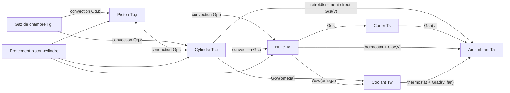
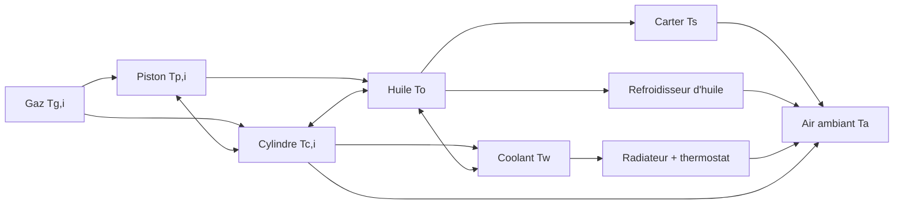

# Modèle thermique de l'huile, du piston et du cylindre

## 1. Objet et statut du document

Ce document décrit les calculs nécessaires pour estimer, dans V-Twin :

- la température moyenne de l'huile, notée $T_o$ ;
- la température moyenne du carter inférieur, notée $T_s$ ;
- la température moyenne du coolant, notée $T_w$ ;
- la température moyenne de chaque piston, notée $T_{p,i}$ ;
- la température moyenne de la paroi de chaque cylindre, notée $T_{c,i}$.

Il s'appuie sur les signaux réellement disponibles dans la codebase. Il distingue volontairement :

1. la température thermodynamique des gaz déjà calculée par le simulateur ;
2. le modèle thermique physique concentré V2 désormais implémenté ;
3. le snapshot de condition qui transmet ces résultats à l'interface sans les recalculer.

Le modèle proposé est une **première version d'estimation**, adaptée à un simulateur temps réel. Il ne constitue ni un calcul de dimensionnement, ni un modèle éléments finis, ni une validation d'un moteur réel. Ses paramètres doivent être calibrés pour chaque moteur.

### 1.1 État de l'implémentation

La V2 décrite dans la section 17 est active dans la codebase. La V1 reste le mode de compatibilité des moteurs qui ne déclarent ni carter ni circuit de coolant :

- `EngineThermalParameters` porte une configuration thermique indépendante ;
- `EngineThermalModel` accumule les flux à chaque sous-pas fluide et intègre le réseau à $50\ \mathrm{Hz}$ par défaut ;
- `EngineCoolingModel` calcule les thermostats, le ventilateur, les pompes et les conductances dépendantes de la vitesse ;
- `EngineThermalState` publie les températures, les états de refroidissement et le bilan de puissance instantané ;
- `Simulator` construit les propriétés thermiques à partir des pistons, bancs et culasses réellement chargés ;
- `EngineConditionModel` publie les températures calculées avec la télémétrie opérationnelle réelle ;
- `EngineConditionCluster` affiche les jauges, la carte par cylindre, le bilan de puissance et les commandes du refroidissement ;
- `engine_thermal_parameters` expose les capacités, conductances, seuils et lois réduites dans les fichiers `.mr` ;
- le carter, le refroidisseur d'huile et le coolant sont des chemins distincts, avec un résidu énergétique vérifié à chaque intégration.

L'asset 2JZ déclare la configuration V2 détaillée en section 10.6. Les moteurs non migrés conservent les valeurs V1 : cela assure leur compatibilité, mais ne constitue pas une calibration physique de ces moteurs.

## 2. Résultat principal de l'étude

Une première version est réalisable avec les informations actuelles, sans ajouter de nouvelles pièces mécaniques à la simulation.

Le périmètre thermique actif comprend :

- un nœud thermique global pour l'huile ;
- un nœud optionnel pour le carter inférieur ;
- un nœud optionnel pour le coolant ;
- un nœud thermique par piston ;
- un nœud thermique par cylindre ;
- la température des gaz de chaque chambre comme source thermique déjà existante ;
- l'air ambiant comme condition limite, modulée par la vitesse du véhicule et le ventilateur.

Les échanges sont représentés par un réseau de capacités et de conductances thermiques :

Cette représentation produit des températures moyennes, suffisamment utiles pour le tableau de condition, les tendances de chauffe et une première détection de surchauffe. Elle ne permet pas de prédire directement la température maximale de la calotte, de la gorge du premier segment ou un point chaud local du liner.

## 3. Signaux sources et état de référence de la codebase

### 3.1 Pièces et signaux disponibles

| Élément | Représentation actuelle | Données utilisables par le modèle thermique |
|---|---|---|
| Chambre de combustion | Un `GasSystem` par cylindre | pression, température des gaz, volume, composition, énergie interne |
| Piston | Corps rigide par cylindre | masse, position, vitesse, effort latéral, coefficient de blow-by |
| Cylindre | Géométrie portée par `CylinderBank` | alésage, hauteur de deck, orientation, nombre de cylindres |
| Frottement piston-cylindre | Modèle de Coulomb, Stribeck et viscosité | force de frottement et vitesse instantanée du piston |
| Huile | Un nœud thermique global, sans circuit hydraulique | volume, densité, capacité calorifique, température moyenne |
| Refroidissement | Réseau concentré configurable | carter, coolant, échangeur huile-air, radiateur, thermostats, ventilateur et facteurs de pompe |

Les principaux fichiers concernés sont :

- `src/domain/engine/gas_system.cpp` et `include/domain/engine/gas_system.h` ;
- `src/domain/engine/combustion_chamber.cpp` ;
- `src/domain/engine/piston.cpp` ;
- `src/domain/engine/cylinder_bank.cpp` ;
- `src/simulation/engine_thermal_model.cpp` et `include/simulation/engine_thermal_model.h` ;
- `src/simulation/engine_condition_model.cpp` ;
- `assets/engines/atg-video-1/03_harley_davidson_shovelhead.mr` ;
- `assets/engines/kohler/kohler_ch750.mr`.

### 3.2 Température des gaz

Le `GasSystem` utilise un gaz parfait avec un nombre de degrés de liberté $f=5$ par défaut. Son énergie interne est :

$$
U_g = \frac{f}{2} n R T_g
$$

La température et la pression sont donc calculées par :

$$
T_g = \frac{U_g}{\frac{f}{2}nR}
$$

$$
p_g = \frac{U_g}{\frac{f}{2}V}
$$

ce qui redonne bien la loi des gaz parfaits :

$$
p_gV=nRT_g
$$

Avec $f=5$, le rapport des capacités thermiques utilisé par le code est :

$$
\gamma = 1 + \frac{2}{f} = 1{,}4
$$

Le volume instantané de la chambre est obtenu à partir de l'alésage, de la position du piston, de la hauteur de deck, de la hauteur de compression et du volume de chambre dans la culasse :

$$
V_i(t) = A_b\left(H_{deck}-s_i(t)-H_{comp}\right)+V_{ch}-V_{disp,piston}
$$

avec :

$$
A_b=\frac{\pi B^2}{4}
$$

La variation de volume modifie l'énergie du gaz par le travail de pression. La combustion ajoute :

$$
\Delta U_{comb}=\Delta m_f\,PCI
$$

où `Fuel::getEnergyDensity()` joue le rôle de pouvoir calorifique massique et où l'efficacité de combustion est appliquée en amont à la masse brûlée.

### 3.3 Transfert thermique gaz-paroi actuel

Le transfert actuellement appliqué dans `CombustionChamber::flow()` est :

$$
\Delta U_{g,paroi} = \left(T_{paroi,fixe}-T_g\right)A_{ch}\,h_{fixe}\,\Delta t
$$

avec :

$$
T_{paroi,fixe}=90\ ^\circ\mathrm{C}=363{,}15\ \mathrm{K}
$$

$$
h_{fixe}=100\ \mathrm{W\,m^{-2}\,K^{-1}}
$$

$$
A_{ch}=\pi B\frac{V}{A_b}+2A_b
$$

Le terme $2A_b$ représente implicitement deux faces planes, assimilables à la calotte du piston et à la culasse. Ce calcul retire ou ajoute de l'énergie aux gaz, mais il ne stocke cette énergie dans aucune pièce solide. La paroi reste toujours à $90\ ^\circ\mathrm{C}$.

Conséquences :

- la température affichée par `CylinderTemperatureGauge` est la température des **gaz**, pas celle de la paroi du cylindre ;
- le solveur gazeux n'utilise pas encore les températures propres du piston et du cylindre calculées par l'observateur ;
- le coefficient de transfert ne dépend ni de la pression, ni du régime, ni de la vitesse du gaz ;
- l'énergie retirée aux gaz par cette ancienne condition de paroi n'est pas le même flux que celui stocké dans l'observateur V1.

### 3.4 Frottement piston-cylindre actuel

La force normale à la paroi est la norme de l'effort de la contrainte de guidage du piston :

$$
F_{wall}=\sqrt{F_x^2+F_y^2}
$$

Le modèle de frottement combine Coulomb, Stribeck et un terme visqueux. Avec $v=|v_p|$ :

$$
F_{coul}=\mu F_{wall}
$$

$$
v_{st}=\sqrt{2}v_b,\qquad v_{coul}=\frac{v_b}{10}
$$

$$
F_f(v)=
\sqrt{2}e(F_b-F_{coul})
\exp\left[-\left(\frac{v}{v_{st}}\right)^2\right]
\frac{v}{v_{st}}
+F_{coul}\tanh\left(\frac{v}{v_{coul}}\right)
+c_vv
$$

où $F_b$ est la force de décollage, $v_b$ sa vitesse caractéristique, $\mu$ le coefficient de frottement et $c_v$ le coefficient visqueux.

Lors de l'application à la dynamique, cette force est atténuée sous $1\ \mathrm{mm\,s^{-1}}$ :

$$
F_{f,appliquée}=F_f\min\left(\frac{|v_p|}{10^{-3}},1\right)
$$

`CombustionChamber::getFrictionForce()` conserve la force avant atténuation pour compatibilité. `getFrictionPower()` applique exactement la même atténuation basse vitesse que la dynamique, puis calcule $|F_{f,appliquée}v_p|$ pour le modèle thermique.

### 3.5 Suppression des anciennes sorties heuristiques

Les anciennes températures cibles, marges normalisées, dommages cumulés, modes de défaillance et projections de durée de vie ont été supprimés. Ils combinaient des pondérations non calibrées et des constantes de temps beaucoup plus courtes qu'une chauffe réelle. Ils pouvaient donc ressembler à des mesures sans avoir de bilan d'énergie ni de données d'essai pour les valider.

La source de vérité thermique est désormais exclusivement `EngineThermalState`. `EngineConditionState` transmet ces valeurs avec les signaux opérationnels directs. Tant qu'un modèle d'usure calibré n'existe pas, l'interface se limite aux températures, flux, commandes et diagnostics physiques ; elle ne génère aucun dommage ni RUL dynamique.

## 4. Périmètre thermique recommandé pour la V1

### 4.1 États calculés

Pour un moteur à $N_c$ cylindres, le vecteur d'état thermique est :

$$
\mathbf{T}=\left[T_o,T_{p,1},\ldots,T_{p,N_c},T_{c,1},\ldots,T_{c,N_c}\right]^T
$$

Pour le Harley Shovelhead ou le Kohler CH750, $N_c=2$. La V1 contient donc cinq températures : une huile, deux pistons et deux cylindres.

Le choix d'un état par cylindre est préférable à une moyenne globale. Les deux bancs d'un V-Twin ne reçoivent pas nécessairement la même charge thermique et peuvent avoir des conditions de refroidissement différentes.

### 4.2 Grandeurs d'entrée

Pour chaque cylindre $i$, le modèle lit :

- $T_{g,i}(t)$ : température instantanée des gaz, en K ;
- $p_i(t)$ : pression absolue de chambre, en Pa ;
- $V_i(t)$ : volume instantané, en $\mathrm{m^3}$ ;
- $v_{p,i}(t)$ : vitesse instantanée du piston, en $\mathrm{m\,s^{-1}}$ ;
- $F_{f,i}(t)$ : force de frottement piston-cylindre, en N ;
- $B_i$ : alésage, en m ;
- $m_{p,i}$ : masse du piston, en kg ;
- $N$ : régime moteur, en tr/min.

Ces grandeurs existent déjà, directement ou par une méthode de calcul existante.

La température ambiante $T_a$ est portée par `EngineThermalParameters`. Sa valeur par défaut explicite est $298{,}15\ \mathrm{K}$.

## 5. Équations du modèle proposé

### 5.1 Capacité thermique d'un nœud

Pour chaque masse supposée isotherme :

$$
C_j=m_jc_{p,j}\quad[\mathrm{J\,K^{-1}}]
$$

et le premier principe donne :

$$
C_j\frac{dT_j}{dt}=\sum_k\dot Q_{k\rightarrow j}+\dot W_{diss,j}
$$

où les flux positifs entrent dans le nœud.

Pour le piston :

$$
C_{p,i}=m_{p,i}c_{p,piston}
$$

Pour le cylindre, la masse n'existe pas dans le modèle géométrique actuel. La V1 doit accepter directement une capacité thermique effective calibrable :

$$
C_{c,i}=m_{c,i}^{eff}c_{p,cylindre}
$$

Pour l'huile :

$$
C_o=V_o\rho_o c_{p,o}
$$

### 5.2 Surface de la calotte du piston

La surface exposée des gaz au piston est approximée par l'aire d'alésage :

$$
A_{p,i}=k_{A,p}\frac{\pi B_i^2}{4}
$$

$k_{A,p}$ corrige une éventuelle calotte bombée, creusée ou non plane. La valeur $k_{A,p}=1$ convient à la géométrie simplifiée actuelle.

### 5.3 Surface instantanée du liner exposée aux gaz

La hauteur exposée est approximée par :

$$
H_{exp,i}(t)=\max\left(0,\frac{V_i(t)-V_{ch,i}}{A_{b,i}}\right)
$$

La surface correspondante est :

$$
A_{c,i}(t)=k_{A,c}\pi B_iH_{exp,i}(t)
$$

Si le volume de chambre $V_{ch,i}$ n'est pas facilement accessible lors de la première implémentation, l'approximation déjà utilisée peut être conservée :

$$
H_{exp,i}(t)\approx\frac{V_i(t)}{A_{b,i}}
$$

Elle surestime légèrement la surface du liner parce qu'elle inclut le volume de culasse. Cette approximation doit être tracée comme une dette de modélisation, pas cachée dans une constante.

### 5.4 Vitesse moyenne du piston

Pour une course $S$ et un régime $N$ en tr/min :

$$
\bar v_p=\frac{2SN}{60}
$$

La codebase possède aussi `CombustionChamber::calculateMeanPistonSpeed()`, qui moyenne la valeur absolue de la vitesse sur 256 positions du cycle. Cette valeur est préférable lorsque le moteur est déjà en mouvement, car elle tient compte de la cinématique réellement simulée.

### 5.5 Coefficient de convection gaz-paroi

#### Option recommandée pour la V1 : Hohenberg

La corrélation de Hohenberg utilise exactement les variables que V-Twin expose déjà :

$$
h_{g,i}=C_HV_i^{-0{,}06}p_{bar,i}^{0{,}8}T_{g,i}^{-0{,}4}\left(\bar v_{p,i}+1{,}4\right)^{0{,}8}
$$

avec :

- $h_g$ en $\mathrm{W\,m^{-2}\,K^{-1}}$ ;
- $C_H=130$ comme valeur publiée usuelle avant calibration ;
- $V$ en $\mathrm{m^3}$ ;
- $p_{bar}$ en bar absolu ;
- $T_g$ en K ;
- $\bar v_p$ en $\mathrm{m\,s^{-1}}$.

Cette relation est empirique et dépend de ses unités. Il faut convertir explicitement la pression interne en bar avant l'exponentiation.

Les entrées doivent être protégées numériquement :

$$
p_{bar}\leftarrow\max(p_{bar},p_{min}),\quad
T_g\leftarrow\max(T_g,T_{min}),\quad
V\leftarrow\max(V,V_{min})
$$

Les minima ne servent qu'à éviter une puissance fractionnaire sur une valeur nulle ou non physique. Toute activation de ces gardes doit être comptabilisée comme anomalie de simulation.

#### Option ultérieure : Woschni

La forme générale de Woschni est :

$$
h_g=3{,}26B^{-0{,}2}p_{kPa}^{0{,}8}T_g^{-0{,}55}w^{0{,}8}
$$

avec $B$ en m, $p$ en kPa, $T_g$ en K et $w$ en $\mathrm{m\,s^{-1}}$.

La vitesse caractéristique $w$ comporte un terme lié au mouvement du piston et un terme lié à l'augmentation de pression due à la combustion. Ce second terme requiert une courbe de pression motored, des états de référence et des constantes dépendant de la phase du cycle. Ces données n'existent pas encore directement dans V-Twin. Woschni est donc une bonne évolution, mais Hohenberg est plus simple et plus cohérent avec le périmètre V1.

### 5.6 Flux des gaz vers le piston et le cylindre

La loi de Newton donne :

$$
\dot Q_{g\rightarrow p,i}=k_{g,p}\,h_{g,i}A_{p,i}\left(T_{g,i}-T_{p,i}\right)
$$

$$
\dot Q_{g\rightarrow c,i}=k_{g,c}\,h_{g,i}A_{c,i}\left(T_{g,i}-T_{c,i}\right)
$$

$k_{g,p}$ et $k_{g,c}$ sont des facteurs de calibration sans dimension. Ils compensent notamment :

- le caractère spatialement moyen de la corrélation ;
- l'absence de champ de vitesse dans la chambre ;
- la géométrie simplifiée des surfaces ;
- l'absence d'un nœud thermique de culasse.

Le signe ne doit pas être forcé à zéro. Lors de l'admission d'un gaz plus froid que la paroi, le flux peut légitimement aller du métal vers le gaz. Une saturation peut toutefois être appliquée à $h_g$ pour empêcher une divergence due à une valeur de pression ou de température aberrante.

### 5.7 Puissance de frottement

La puissance dissipée par le contact piston-cylindre est :

$$
P_{f,i}=\left|F_{f,appliquée,i}v_{p,i}\right|
$$

Cette puissance devient intégralement de la chaleur dans le périmètre considéré. Elle est répartie entre le piston, le cylindre et l'huile :

$$
\alpha_p+\alpha_c+\alpha_o=1
$$

$$
\dot Q_{f\rightarrow p,i}=\alpha_pP_{f,i}
$$

$$
\dot Q_{f\rightarrow c,i}=\alpha_cP_{f,i}
$$

$$
\dot Q_{f\rightarrow o,i}=\alpha_oP_{f,i}
$$

Les fractions doivent être calibrables. Leur somme doit être vérifiée au chargement de la configuration afin de ne pas créer ou détruire d'énergie.

La V1 ne doit pas ajouter une seconde estimation de FMEP par-dessus `getFrictionForce()`, car cela compterait deux fois le même mécanisme piston-liner. Les pertes des paliers, de la distribution et du vilebrequin ne sont pas incluses tant qu'elles ne sont pas exposées comme puissances dissipées distinctes.

### 5.8 Échanges entre nœuds

Un échange entre deux nœuds $a$ et $b$ est représenté par une conductance thermique $G_{ab}$ :

$$
\dot Q_{a\rightarrow b}=G_{ab}(T_a-T_b)
$$

avec :

$$
G_{ab}=\frac{1}{R_{th,ab}}=U_{ab}A_{ab}\quad[\mathrm{W\,K^{-1}}]
$$

Les conductances nécessaires sont :

- $G_{pc}$ : piston vers cylindre, principalement par les segments et les contacts ;
- $G_{po}$ : piston vers huile, par le dessous de calotte et le brouillard d'huile ;
- $G_{co}$ : cylindre vers huile ;
- $G_{ca}$ : cylindre vers air ambiant ;
- $G_{oa}$ : huile vers air ambiant, carter et éventuel radiateur d'huile équivalent.

Dans un V-Twin refroidi par air, $G_{ca}$ représente les ailettes, la convection naturelle ou forcée et la vitesse d'air. La géométrie des ailettes et la vitesse du véhicule ne sont pas disponibles aujourd'hui ; $G_{ca}$ est donc un paramètre effectif à calibrer séparément pour les deux bancs si nécessaire.

### 5.9 Bilan du piston

Pour chaque piston :

$$
C_{p,i}\frac{dT_{p,i}}{dt}=
\dot Q_{g\rightarrow p,i}
+\alpha_pP_{f,i}
-G_{pc,i}(T_{p,i}-T_{c,i})
-G_{po,i}(T_{p,i}-T_o)
$$

### 5.10 Bilan du cylindre

Pour chaque cylindre :

$$
C_{c,i}\frac{dT_{c,i}}{dt}=
\dot Q_{g\rightarrow c,i}
+\alpha_cP_{f,i}
+G_{pc,i}(T_{p,i}-T_{c,i})
-G_{co,i}(T_{c,i}-T_o)
-G_{ca,i}(T_{c,i}-T_a)
$$

### 5.11 Bilan de l'huile

L'huile est supposée parfaitement mélangée dans un seul volume :

$$
C_o\frac{dT_o}{dt}=
\sum_{i=1}^{N_c}\left[
G_{po,i}(T_{p,i}-T_o)
+G_{co,i}(T_{c,i}-T_o)
+\alpha_oP_{f,i}
\right]
-G_{oa}(T_o-T_a)
$$

Si un radiateur d'huile doit être ajouté sans créer un nouveau nœud :

$$
\dot Q_{oilcooler}=UA_{oilcooler}\left(T_o-T_a\right)
$$

et sa conductance peut être incluse dans $G_{oa}$.

### 5.12 Viscosité de l'huile

La température peut ensuite alimenter un modèle de viscosité. Une interpolation ASTM de type Walther peut être utilisée à partir des viscosités cinématiques mesurées à deux températures :

$$
\log_{10}\left[\log_{10}(\nu+C)\right]=A-B\log_{10}(T)
$$

où $T$ est en K, $\nu$ en $\mathrm{mm^2\,s^{-1}}$ et $A$, $B$, $C$ dépendent de la convention et de l'huile.

Cette relation n'est pas nécessaire pour calculer $T_o$ dans la V1. Elle devient pertinente lorsque la force de frottement, la pression d'huile ou la marge de lubrification doivent dépendre de la viscosité. Les coefficients doivent provenir de données d'huile identifiées, pas d'une classe SAE seule.

## 6. Paramètres par composante

### 6.1 Piston

| Paramètre | Unité | Disponible | Traitement V1 |
|---|---:|---:|---|
| Masse $m_p$ | kg | oui | lire `Piston::getMass()` |
| Alésage $B$ | m | oui | lire `CylinderBank::getBore()` |
| Vitesse $v_p$ | m/s | oui | lire `CombustionChamber::pistonSpeed()` |
| Force de frottement $F_f$ | N | partiellement | exposer la force appliquée avec son atténuation basse vitesse |
| Capacité calorifique $c_{p,piston}$ | J/kg/K | non | ajouter à la configuration thermique |
| Facteur de surface $k_{A,p}$ | 1 | non | défaut 1, puis calibration |
| Conductances $G_{pc}$ et $G_{po}$ | W/K | non | ajouter et calibrer |
| Fraction de frottement $\alpha_p$ | 1 | non | ajouter avec contrôle de somme |

La masse de piston inclut ce que le fichier moteur lui attribue. Elle ne doit pas être remplacée par une masse générique si l'asset en fournit déjà une.

### 6.2 Cylindre

| Paramètre | Unité | Disponible | Traitement V1 |
|---|---:|---:|---|
| Alésage $B$ | m | oui | lire le banc |
| Volume instantané $V(t)$ | m³ | oui | lire la chambre |
| Hauteur exposée | m | dérivable | calculer avec $V/A_b$ |
| Masse thermique effective $m_c^{eff}$ | kg | non | ajouter ou fournir directement $C_c$ |
| Capacité calorifique $c_{p,cylindre}$ | J/kg/K | non | ajouter si $m_c^{eff}$ est utilisé |
| Conductances $G_{pc}$, $G_{co}$, $G_{ca}$ | W/K | non | ajouter et calibrer |
| Fraction de frottement $\alpha_c$ | 1 | non | ajouter avec contrôle de somme |
| Surface d'ailettes | m² | non | absorbée dans $G_{ca}$ en V1 |

Le terme « cylindre » désigne ici la masse thermique effective du liner et de la partie locale du bloc ou du fût. Ce n'est pas la température des gaz et ce n'est pas la température de culasse.

### 6.3 Huile

| Paramètre | Unité | Disponible | Traitement V1 |
|---|---:|---:|---|
| Volume $V_o$ | m³ | non | ajouter à la configuration moteur |
| Masse volumique $\rho_o$ | kg/m³ | non | données de l'huile |
| Capacité calorifique $c_{p,o}$ | J/kg/K | non | données de l'huile |
| Conductance vers l'air $G_{oa}$ | W/K | non | ajouter et calibrer |
| Fraction de frottement $\alpha_o$ | 1 | non | ajouter avec contrôle de somme |
| Débit d'huile | kg/s | non | non requis pour le volume global V1 |
| Viscosité en fonction de $T$ | Pa·s ou mm²/s | non | option après V1 |

### 6.4 Paramètres d'initialisation

Au chargement d'un moteur froid :

$$
T_o(0)=T_{p,i}(0)=T_{c,i}(0)=T_a
$$

Une option de démarrage à chaud peut accepter des températures initiales explicites. La V1 ne doit pas réutiliser les initialisations actuelles à $94\ ^\circ\mathrm{C}$ et $88\ ^\circ\mathrm{C}$ pour un démarrage froid.

## 7. Hypothèses de modélisation

### 7.1 Hypothèses retenues

1. Chaque piston est isotherme et représenté par une température moyenne.
2. Chaque cylindre est isotherme et représenté par une température moyenne.
3. L'huile est parfaitement mélangée dans un volume global.
4. Les capacités calorifiques et masses volumiques sont constantes dans la V1.
5. La convection gaz-paroi est représentée par une corrélation zéro dimension empirique.
6. Les échanges solides et huile sont représentés par des conductances constantes.
7. La puissance de frottement piston-liner est entièrement convertie en chaleur.
8. Le refroidissement du cylindre est ramené à une conductance équivalente vers l'air ambiant.
9. Le rayonnement de flamme et de gaz est inclus implicitement dans la calibration du transfert gaz-paroi.
10. Le modèle thermique n'agit pas sur les jeux, la dilatation, le blow-by ou la viscosité en V1.

### 7.2 Interprétation physique des sorties

Les sorties sont des températures de masse concentrée :

- $T_p$ est une température moyenne de piston, pas une température maximale de calotte ;
- $T_c$ est une température moyenne de fût/liner, pas une température locale de surface ;
- $T_o$ se rapproche d'une température moyenne de carter, pas d'une température locale de film au segment ou au palier.

L'hypothèse de température uniforme est généralement évaluée avec le nombre de Biot :

$$
Bi=\frac{hL_c}{k_s}
$$

Une approximation concentrée est classiquement robuste lorsque $Bi<0{,}1$. La V1 ne possède ni épaisseur détaillée ni conductivité de chaque pièce ; ce critère ne peut donc pas être démontré. Les sorties doivent rester qualifiées de températures moyennes estimées.

## 8. Couplage avec la simulation existante

### 8.1 V1 recommandée : observateur thermique à sens unique

La première intégration doit lire les états des gaz sans modifier `GasSystem::m_state.E_k`.

Avantages :

- aucun risque de déstabiliser la combustion et les performances actuelles ;
- comparaison directe avec les températures heuristiques existantes ;
- calibration possible avant de modifier le bilan énergétique des chambres ;
- architecture compatible avec le snapshot `EngineConditionState`.

Limite : le transfert thermique est compté dans l'observateur alors que le gaz continue d'utiliser sa paroi fixe à $90\ ^\circ\mathrm{C}$. Le bilan d'énergie global n'est donc pas fermé. Cette V1 est un estimateur, pas encore un couplage thermodynamique complet.

### 8.2 V2 couplée : conservation de l'énergie

Après calibration de l'observateur, le terme actuel :

$$
100A_{ch}(363{,}15-T_g)
$$

doit être remplacé par les flux dynamiques :

$$
\frac{dU_g}{dt}=-\dot Q_{g\rightarrow p}-\dot Q_{g\rightarrow c}-\dot Q_{g\rightarrow autres}
$$

$\dot Q_{g\rightarrow autres}$ conserve un chemin thermique pour la culasse et les soupapes non représentées par les trois états demandés. Il peut être modélisé initialement par une paroi fixe ou une conductance calibrée. Le supprimer entièrement attribuerait au piston et au liner toute la chaleur de chambre et les surchaufferait artificiellement.

Dans la V2, chaque joule retiré aux gaz et attribué au piston ou au cylindre doit être ajouté au nœud correspondant au même pas de temps.

### 8.3 Moyennage des sources rapides

La physique tourne typiquement entre $10$ et $35\ \mathrm{kHz}$ selon le moteur, alors que le réseau thermique est intégré à $50\ \mathrm{Hz}$ par défaut. Un échantillon instantané de $T_g$ toutes les $20\ \mathrm{ms}$ dépendrait de la position du vilebrequin et provoquerait de l'aliasing.

Il faut accumuler l'énergie sur tous les pas fluides :

$$
E_{g\rightarrow p,i}^{acc}=\sum_k\dot Q_{g\rightarrow p,i,k}\Delta t_{fluid}
$$

$$
E_{g\rightarrow c,i}^{acc}=\sum_k\dot Q_{g\rightarrow c,i,k}\Delta t_{fluid}
$$

$$
E_{f,i}^{acc}=\sum_kP_{f,i,k}\Delta t_{phys}
$$

Puis, au pas thermique $\Delta t_{th}$ :

$$
\overline{\dot Q}_{g\rightarrow p,i}=\frac{E_{g\rightarrow p,i}^{acc}}{\Delta t_{th}}
$$

La corrélation non linéaire doit être évaluée avant l'accumulation. Calculer $h_g$ à partir de moyennes de $p$, $T$ et $V$ ne donne pas le même résultat que moyenner le flux instantané.

## 9. Intégration numérique

### 9.1 Euler explicite

Pour chaque nœud :

$$
T_j^{n+1}=T_j^n+\frac{\Delta t}{C_j}\dot Q_j^n
$$

Tous les flux internes doivent être calculés à partir du même vecteur $\mathbf T^n$, puis toutes les températures doivent être mises à jour ensemble. Une mise à jour séquentielle utiliserait certaines températures à $n$ et d'autres à $n+1$, ce qui introduirait une erreur de conservation.

### 9.2 Condition de stabilité

Pour un nœud linéaire relié à plusieurs conductances, une limite prudente d'Euler explicite est :

$$
\Delta t < \frac{2C_j}{\sum_kG_{jk}}
$$

Avec des capacités métalliques ou d'huile réalistes, un pas de $20\ \mathrm{ms}$ est normalement très inférieur aux constantes de temps thermiques. La condition doit malgré tout être vérifiée au chargement de chaque configuration.

Si une conductance élevée rend le système raide, deux solutions sont préférables à une saturation arbitraire de température :

- sous-échantillonner le pas thermique ;
- intégrer le petit système linéaire de manière implicite.

### 9.3 Invariants et contrôles

À chaque pas :

- $C_p>0$, $C_c>0$, $C_o>0$ ;
- toutes les conductances sont positives ou nulles ;
- $\alpha_p+\alpha_c+\alpha_o=1$ à la tolérance numérique ;
- toutes les températures internes sont en K ;
- toutes les pressions utilisées par la corrélation sont absolues ;
- aucune valeur `NaN` ou infinie n'est publiée ;
- les conversions en degrés Celsius n'ont lieu qu'à la frontière d'affichage.

Le résidu énergétique des nœuds thermiques est :

$$
r_E=\frac{\Delta U_{nodes}}{\Delta t}-
\left[
\sum_i(\dot Q_{g\rightarrow p,i}+\dot Q_{g\rightarrow c,i}+P_{f,i})
-\sum_iG_{ca,i}(T_{c,i}-T_a)
-G_{oa}(T_o-T_a)
\right]
$$

Les échanges $G_{pc}$, $G_{po}$ et $G_{co}$ ne figurent pas dans ce bilan global : ils doivent s'annuler exactement entre les équations. Pour un pas explicite calculé simultanément, $r_E$ doit rester proche de l'erreur d'arrondi.

## 10. Exemple chiffré sur le Harley Shovelhead fourni

Cet exemple illustre une itération. Il ne constitue pas une calibration du moteur réel.

### 10.1 Géométrie disponible dans l'asset

Le fichier `assets/engines/atg-video-1/03_harley_davidson_shovelhead.mr` fournit :

- deux cylindres ;
- alésage $B=3{,}5\ \mathrm{in}=0{,}0889\ \mathrm{m}$ ;
- course $S=4{,}25\ \mathrm{in}=0{,}10795\ \mathrm{m}$ ;
- masse d'un piston $m_p=0{,}5\ \mathrm{kg}$ ;
- volume de chambre $V_{ch}=100\ \mathrm{cm^3}$ par cylindre.

La surface de calotte est :

$$
A_p=\frac{\pi(0{,}0889)^2}{4}=0{,}006207\ \mathrm{m^2}
$$

Le volume balayé par cylindre est :

$$
V_d=A_pS=0{,}0006701\ \mathrm{m^3}=670{,}1\ \mathrm{cm^3}
$$

À mi-course, le volume approximatif vaut :

$$
V=V_{ch}+\frac{V_d}{2}=0{,}0004350\ \mathrm{m^3}
$$

La surface moyenne de liner exposée à mi-course est :

$$
A_c=\pi B\frac{S}{2}=0{,}015075\ \mathrm{m^2}
$$

À $3000\ \mathrm{tr/min}$ :

$$
\bar v_p=\frac{2\times0{,}10795\times3000}{60}=10{,}795\ \mathrm{m\,s^{-1}}
$$

### 10.2 État illustratif

On suppose, pour un cylindre :

| Grandeur | Valeur |
|---|---:|
| Température des gaz $T_g$ | 900 K |
| Pression $p$ | 5 bar absolus |
| Température du piston $T_p$ | 450 K |
| Température du cylindre $T_c$ | 410 K |
| Température de l'huile $T_o$ | 370 K |
| Température ambiante $T_a$ | 298 K |
| Force de frottement $F_f$ | 120 N |
| Vitesse utilisée pour le frottement $|v_p|$ | 5,3975 m/s |

La corrélation de Hohenberg donne :

$$
h_g=130(0{,}0004350)^{-0{,}06}(5)^{0{,}8}(900)^{-0{,}4}(10{,}795+1{,}4)^{0{,}8}
$$

$$
h_g\approx365\ \mathrm{W\,m^{-2}\,K^{-1}}
$$

Avec $k_{g,p}=k_{g,c}=1$ :

$$
\dot Q_{g\rightarrow p}=365\times0{,}006207\times(900-450)
\approx1019\ \mathrm{W}
$$

$$
\dot Q_{g\rightarrow c}=365\times0{,}015075\times(900-410)
\approx2695\ \mathrm{W}
$$

La puissance de frottement vaut :

$$
P_f=120\times5{,}3975\approx648\ \mathrm{W}
$$

### 10.3 Paramètres thermiques illustratifs

On prend uniquement pour démontrer le calcul :

| Paramètre | Valeur |
|---|---:|
| $c_{p,piston}$ | 900 J/kg/K |
| $C_p$ | 450 J/K par piston |
| $C_c$ | 2000 J/K par cylindre |
| Volume d'huile | 3 L |
| $\rho_o$ | 850 kg/m³ |
| $c_{p,o}$ | 2000 J/kg/K |
| $C_o$ | 5100 J/K pour le moteur |
| $G_{pc}$ | 6 W/K |
| $G_{po}$ | 8 W/K |
| $G_{co}$ | 10 W/K |
| $G_{ca}$ | 10 W/K |
| $G_{oa}$ | 5 W/K |
| $(\alpha_p,\alpha_c,\alpha_o)$ | $(0{,}35,0{,}45,0{,}20)$ |

Les flux internes pour un cylindre sont :

$$
\dot Q_{p\rightarrow c}=6(450-410)=240\ \mathrm{W}
$$

$$
\dot Q_{p\rightarrow o}=8(450-370)=640\ \mathrm{W}
$$

$$
\dot Q_{c\rightarrow o}=10(410-370)=400\ \mathrm{W}
$$

$$
\dot Q_{c\rightarrow a}=10(410-298)=1120\ \mathrm{W}
$$

Pour l'ensemble du moteur :

$$
\dot Q_{o\rightarrow a}=5(370-298)=360\ \mathrm{W}
$$

### 10.4 Dérivées et pas de 20 ms

Pour un piston :

$$
\dot Q_p=1019+0{,}35(648)-240-640
\approx365{,}7\ \mathrm{W}
$$

$$
\Delta T_p=\frac{0{,}02}{450}\times365{,}7
\approx0{,}0163\ \mathrm{K}
$$

Pour un cylindre :

$$
\dot Q_c=2695+0{,}45(648)+240-400-1120
\approx1706{,}1\ \mathrm{W}
$$

$$
\Delta T_c=\frac{0{,}02}{2000}\times1706{,}1
\approx0{,}0171\ \mathrm{K}
$$

Pour l'huile commune aux deux cylindres :

$$
\dot Q_o=2\left[640+400+0{,}20(648)\right]-360
\approx1979{,}1\ \mathrm{W}
$$

$$
\Delta T_o=\frac{0{,}02}{5100}\times1979{,}1
\approx0{,}00776\ \mathrm{K}
$$

### 10.5 Vérification de conservation

La somme des puissances stockées par les cinq nœuds vaut :

$$
2\dot Q_p+2\dot Q_c+\dot Q_o\approx6122{,}6\ \mathrm{W}
$$

Les seuls apports et rejets externes donnent :

$$
2(\dot Q_{g\rightarrow p}+\dot Q_{g\rightarrow c}+P_f)
-2\dot Q_{c\rightarrow a}
-\dot Q_{o\rightarrow a}
\approx6122{,}6\ \mathrm{W}
$$

Les flux internes s'annulent donc correctement.

### 10.6 Configuration V2 du 2JZ fourni

L'asset `assets/engines/atg-video-2/03_2jz.mr` représente un six-cylindres en ligne refroidi par liquide. Les anciennes valeurs V1 sous-estimaient fortement son inertie et regroupaient le carter, le coolant et les échangeurs dans deux conductances constantes. Cette topologie ne pouvait pas reproduire la différence entre un arrêt, un roulage à $105\ \mathrm{mph}$ et l'action du ventilateur.

Le manuel Toyota de la Supra indique une capacité d'huile avec filtre de $5{,}2\ \mathrm{L}$ pour le 2JZ-GE et $5{,}0\ \mathrm{L}$ pour le 2JZ-GTE, ainsi qu'une capacité de refroidissement de $8{,}0$ à $8{,}9\ \mathrm{L}$ selon la version. L'asset utilise la configuration effective suivante :

| Famille | Paramètre | Valeur V2 |
|---|---|---:|
| Inertie | volume d'huile | $5{,}0\ \mathrm{L}$ |
| Inertie | $C_c$ par cylindre | $18\ 000\ \mathrm{J/K}$ |
| Inertie | $C_s$ du carter | $6\ 000\ \mathrm{J/K}$ |
| Inertie | $C_w$ du coolant | $32\ 000\ \mathrm{J/K}$ |
| Métal/huile | $G_{pc}$, $G_{po}$, $G_{co}$ | $18$, $12$, $8\ \mathrm{W/K}$ par cylindre |
| Carter | $G_{os}$ | $90\ \mathrm{W/K}$ |
| Carter/air | $G_{sa,nat}$, $G_{sa,ref}$ | $4$, $25\ \mathrm{W/K}$ |
| Huile/air | $G_{oc,nat}$, $G_{oc,ref}$ | $0$, $35\ \mathrm{W/K}$ |
| Cylindre/coolant | $G_{cw,stat}$, $G_{cw,pump}$ | $10$, $140\ \mathrm{W/K}$ par cylindre |
| Huile/coolant | $G_{ow,stat}$, $G_{ow,pump}$ | $5$, $100\ \mathrm{W/K}$ |
| Radiateur/air | $G_{rad,nat}$, $G_{rad,ref}$ | $20$, $650\ \mathrm{W/K}$ |
| Air | $v_{ref}$, $n_v$, $v_{max}$ | $30\ \mathrm{m/s}$, $0{,}6$, $70\ \mathrm{m/s}$ |
| Thermostats | huile | $90$ à $105\ ^\circ\mathrm{C}$ |
| Thermostats | coolant | $82$ à $92\ ^\circ\mathrm{C}$ |
| Ventilateur | commande, $v_{fan,max}$ | $94$ à $102\ ^\circ\mathrm{C}$, $8\ \mathrm{m/s}$ |
| Pompes | régime de référence, exposant, bornes | $3000\ \mathrm{tr/min}$, $0{,}8$, $0$ à $1{,}5$ |
| Gaz/paroi | $k_{g,p}$, $k_{g,c}$ | $0{,}45$, $0{,}35$ |
| Frottement | $\mu$, $F_{brk}$, $v_{brk}$, $c_v$ | $0{,}04$, $50\ \mathrm{N}$, $0{,}1\ \mathrm{m/s}$, $6\ \mathrm{N\,s/m}$ |

À $105\ \mathrm{mph}$, soit environ $46{,}9\ \mathrm{m/s}$, cette configuration donne avant commande thermostatique $G_{sa}\approx36{,}7\ \mathrm{W/K}$ et $G_{oc}\approx45{,}8\ \mathrm{W/K}$. La vitesse d'air radiateur vaut $v_{rad}\approx39{,}9\ \mathrm{m/s}$ ventilateur arrêté et sa conductance totalement ouverte vaut environ $791\ \mathrm{W/K}$. À $6500\ \mathrm{tr/min}$, les deux facteurs de pompe atteignent leur borne $1{,}5$.

Ces valeurs, à l'exception des volumes publiés, ne sont pas des caractéristiques Toyota mesurées. Elles constituent une calibration d'ingénierie bornée par les capacités physiques, une enveloppe de FMEP et cinq familles de scénarios numériques. L'échangeur huile-air représente ici un chemin auxiliaire effectif de la configuration simulée ; il ne prétend pas décrire l'équipement de toutes les variantes du 2JZ. Une identification finale exige des transitoires synchronisés de régime, couple, températures d'huile, de coolant, de bloc et d'ambiance.

## 11. État des étapes d'implémentation

1. Terminé : paramètres V1 et V2 indépendants de l'interface.
2. Terminé : états $T_o$, $T_s$, $T_w$, $T_{p,i}$ et $T_{c,i}$ initialisés à l'ambiante.
3. Terminé : accumulation des flux gaz-paroi, du frottement et du point de fonctionnement rapide.
4. Terminé : carter, échangeur huile-air, coolant et radiateur séparés.
5. Terminé : convection forcée par la vitesse, thermostats continus et ventilateur.
6. Terminé : facteurs de pompes dépendants du régime et bornés.
7. Terminé : intégration simultanée à $50\ \mathrm{Hz}$ et stabilité vérifiée sur les conductances maximales.
8. Terminé : bilan de puissance publié avec résidu relatif contrôlé.
9. Terminé : interface alimentée par une source de vérité sans données thermiques aléatoires.
10. Terminé : calibration d'ingénierie et scénarios de non-régression du 2JZ.
11. À faire avec des données externes : identification et validation expérimentales du 2JZ.
12. Reporté : remplacement de la paroi gazeuse fixe à $90\ ^\circ\mathrm{C}$ par un couplage retour vers le `GasSystem`.

Les températures ne doivent pas être calculées dans la couche UI. L'interface affiche uniquement les snapshots `EngineThermalState` et `EngineConditionState` produits par la couche simulation.

## 12. Vérification et validation

### 12.1 Tests unitaires mathématiques

- À $T_g=T_p=T_c=T_o=T_a$ et $P_f=0$, toutes les dérivées sont nulles.
- Sans refroidissement et sans apport, l'énergie totale des nœuds reste constante.
- Un échange isolé entre deux nœuds conserve $C_1T_1+C_2T_2$.
- La somme des fractions de frottement différente de 1 provoque un rejet de configuration.
- Une pression en Pa passée par erreur comme une pression en bar doit être détectée par une borne de coefficient.
- Les conversions K vers °C sont testées séparément.
- Le résultat reste presque identique lorsque le pas thermique est divisé par deux.

Le fichier `test/engine_thermal_model_tests.cpp` couvre la valeur Hohenberg de l'exemple, l'équilibre à l'ambiante, la conservation de l'énergie de frottement, la symétrie, la validation des fractions, la saturation du coefficient, l'indépendance au sous-échantillonnage, la stabilité d'Euler et les gardes sur les entrées physiques.

Le fichier `test/engine_cooling_model_tests.cpp` couvre en plus :

- la loi de convection à $v_{ref}$ et sa saturation à $v_{max}$ ;
- la continuité des thermostats et les bornes des pompes ;
- l'augmentation distincte des rejets carter, huile et radiateur avec la vitesse ou le ventilateur ;
- le bilan conservatif du réseau étendu ;
- les enveloppes 2JZ au ralenti, en croisière, en haut régime et en pleine charge ;
- une température d'huile plus basse en roulage qu'à l'arrêt sous les mêmes sources thermiques.

### 12.2 Scénarios de simulation

#### Démarrage à froid

- toutes les pièces démarrent à l'ambiante ;
- le piston chauffe avant la masse d'huile globale ;
- aucune température ne saute instantanément vers $90\ ^\circ\mathrm{C}$ ;
- l'huile conserve une inertie de plusieurs minutes selon sa capacité et les conductances calibrées.

#### Régime stationnaire

- les dérivées convergent vers zéro ;
- les apports gaz et frottement égalent les rejets à l'ambiante ;
- les deux cylindres convergent vers la même température si leurs entrées et paramètres sont identiques.

#### Refroidissement dépendant du roulage

- à sources gaz et frottement identiques, $47\ \mathrm{m/s}$ produit un rejet supérieur à $0\ \mathrm{m/s}$ ;
- sous le seuil du thermostat, le radiateur reste fermé sans supprimer les échanges internes ;
- à l'arrêt et coolant chaud, le ventilateur maintient une vitesse d'air radiateur non nulle ;
- à haut régime, les conductances hydrauliques atteignent leur borne au lieu de croître sans limite.

#### Régression 2JZ

Les scénarios synthétiques ne rejouent pas un cycle homologué. Ils injectent des moyennes représentatives et vérifient des enveloppes : ralenti $900\ \mathrm{tr/min}$, croisière $2500\ \mathrm{tr/min}$ à $27\ \mathrm{m/s}$, haut régime $6500\ \mathrm{tr/min}$, puis pleine charge à l'arrêt et à $47\ \mathrm{m/s}$. Le cas interactif d'environ une minute en sixième à $123\ \mathrm{mph}$ a produit, depuis un démarrage froid, environ $61\ ^\circ\mathrm{C}$ pour l'huile, $118\ ^\circ\mathrm{C}$ pour le piston moyen, $42\ ^\circ\mathrm{C}$ pour le cylindre moyen et $39\ ^\circ\mathrm{C}$ pour le coolant. Ces nombres servent de contrôle de régression, pas de cible Toyota stationnaire.

#### Différence entre bancs

- une réduction de $G_{ca}$ sur le cylindre arrière doit produire une température de cylindre plus élevée ;
- l'huile commune transmet une partie de cette asymétrie à l'ensemble du moteur.

#### Coupure moteur

- les apports gaz et frottement disparaissent ;
- les trois familles de température décroissent continûment vers l'ambiante ;
- aucune température ne passe sous l'ambiante sans condition limite froide explicite.

### 12.3 Données de calibration minimales

Pour identifier correctement les paramètres, il faut idéalement disposer de plusieurs transitoires et points stationnaires :

- température ambiante ;
- régime, couple ou charge ;
- température d'huile au carter ;
- température du coolant en entrée et sortie moteur ;
- température de paroi du carter inférieur ;
- température de liner ou de surface de cylindre ;
- température de piston mesurée ou reconstruite ;
- temps depuis le démarrage ;
- vitesse véhicule, état du ventilateur et conditions de flux d'air autour du moteur.

Les capacités $C$ contrôlent principalement la vitesse de chauffe. Les conductances $G$ contrôlent principalement les écarts stationnaires et les chemins de dissipation. Ajuster uniquement les conductances sur un seul point stationnaire ne permet pas d'identifier correctement les inerties.

## 13. Limites actuelles et impact sur la précision

### 13.1 Pièces thermiques absentes

La culasse, les soupapes, les segments, la bielle, le vilebrequin, les paliers et l'échappement existent pour tout ou partie dans la simulation mécanique ou gazeuse, mais pas comme masses thermiques couplées. Le carter et le coolant existent maintenant comme masses thermiques concentrées, sans géométrie ni discrétisation spatiale.

Leur absence pose trois problèmes :

- une partie réelle de la chaleur de combustion n'a pas de destination physique ;
- une partie réelle du chauffage de l'huile par les paliers et la distribution est absente ;
- les chemins de conduction du piston par les segments et l'axe sont regroupés dans des conductances effectives.

Cela n'empêche pas cette première V2, à condition de calibrer les conductances et de qualifier les sorties comme des estimations moyennes.

### 13.2 Refroidissement du V-Twin

Les deux V-Twin de référence sont refroidis par air dans leur usage réel. La codebase reçoit maintenant la vitesse véhicule et peut convertir celle-ci en conductance forcée, mais elle ne simule ni géométrie d'ailettes, ni champ aérodynamique, ni masquage du cylindre arrière.

La V2 permet $G_{ca}(v)$, mais utilise une même loi pour tous les cylindres. La configuration devra accepter des coefficients par banc avant de représenter le masquage du cylindre arrière. La vitesse véhicule reste un proxy de vitesse d'air : elle ne représente pas un vent latéral, le sillage du cadre ou la recirculation à l'arrêt.

$$
G_{ca}=G_{nat}+k_vv_{air}^{n}
$$

### 13.3 Huile

L'huile possède une température circulante, un carter concentré, un facteur de pompe et deux échangeurs effectifs. Elle n'a cependant ni débit massique calculé, ni galerie, ni pression, ni perte de charge, ni carter géométrique. Ce réseau ne peut pas représenter :

- la température locale du film piston-liner ;
- la température de sortie des paliers ;
- un jet d'huile sous piston ;
- la stratification du carter ;
- un défaut d'alimentation ou de pression.

Le facteur de pompe modifie un $UA$ ; ce n'est ni un débit en $\mathrm{kg/s}$ ni une pression en Pa. La température globale reste néanmoins exploitable pour la chauffe et la tendance de viscosité.

### 13.4 Coolant et échangeurs

Le coolant est un volume bien mélangé unique. Le modèle ne distingue ni sortie de culasse, ni entrée de pompe, ni durites, ni température amont/aval du radiateur. Le thermostat et le ventilateur sont continus et sans hystérésis. Les échangeurs sont des $UA$ quasi stationnaires sans inertie propre, efficacité $\varepsilon$-NTU ni dépendance explicite aux débits des deux fluides.

### 13.5 Température des gaz et transfert actuel

L'observateur V2 utilise une température de gaz déjà influencée par la paroi fixe à $90\ ^\circ\mathrm{C}$. Son réseau propre est conservatif, mais la chaleur attribuée au piston et au cylindre n'est pas encore retirée une seconde fois au `GasSystem`. Les paramètres calibrés dans ce mode ne seront pas nécessairement transférables sans modification à un futur couplage bidirectionnel.

### 13.6 Valeurs maximales

Un nœud concentré ne donne aucune distribution spatiale. Les seuils de sécurité portant sur une gorge de segment, une calotte ou un point chaud de liner ne doivent pas être appliqués directement à $T_p$ ou $T_c$ sans une relation de reconstruction calibrée :

$$
T_{hotspot}=aT_{moy}+b\dot Q_{gaz}+c
$$

Une telle relation serait empirique et spécifique au moteur.

### 13.7 Domaine de validité

Les corrélations de Woschni et Hohenberg fournissent un coefficient moyen empirique. Elles ne décrivent pas précisément les gradients locaux, le front de flamme, le cliquetis, l'impact d'un jet d'huile ou la turbulence tridimensionnelle.

La première version convient à :

- une visualisation temps réel cohérente ;
- des comparaisons relatives entre charges ;
- des transitoires de chauffe calibrés ;
- l'alimentation d'un modèle d'usure qualitatif.

Elle ne convient pas seule à :

- la validation d'une limite matière ;
- le dimensionnement des ailettes ;
- le calcul d'un jeu piston-cylindre ;
- la certification d'une huile ;
- la prédiction d'une défaillance réelle sans données d'essai.

## 14. Références scientifiques

1. G. Woschni, « A Universally Applicable Equation for the Instantaneous Heat Transfer Coefficient in the Internal Combustion Engine », SAE Technical Paper 670931, 1967. [DOI 10.4271/670931](https://saemobilus.sae.org/papers/a-universally-applicable-equation-instantaneous-heat-transfer-coefficient-internal-combustion-engine-670931).
2. G. F. Hohenberg, « Advanced Approaches for Heat Transfer Calculations », SAE Technical Paper 790825, 1979. [DOI 10.4271/790825](https://saemobilus.sae.org/papers/advanced-approaches-heat-transfer-calculations-790825).
3. G. Borman et K. Nishiwaki, « Internal-combustion engine heat transfer », *Progress in Energy and Combustion Science*, vol. 13, no 1, 1987, p. 1-46. [DOI 10.1016/0360-1285(87)90005-0](https://www.sciencedirect.com/science/article/pii/0360128587900050).
4. J. B. Heywood, *Internal Combustion Engine Fundamentals*, 2e édition, McGraw-Hill, 2018/2019. [Présentation de l'éditeur](https://www.mheducation.com/highered/mhp/product/internal-combustion-engine-fundamentals-2e.html).
5. J. Wagner, E. Marotta et I. Paradis, « Thermal Modeling of Engine Components for Temperature Prediction and Fluid Flow Regulation », SAE Technical Paper 2001-01-1014. Le papier traite explicitement des modèles multi-nœuds concentrés pour moteurs refroidis par air et par liquide. [DOI 10.4271/2001-01-1014](https://saemobilus.sae.org/papers/thermal-modeling-engine-components-temperature-prediction-fluid-flow-regulation-2001-01-1014).
6. S. Zoz, S. Strepek, M. Wiseman et C. Qian, « Engine Lubrication System Model for Sump Oil Temperature Prediction », SAE Technical Paper 2001-01-1073. [DOI 10.4271/2001-01-1073](https://saemobilus.sae.org/papers/engine-lubrication-system-model-sump-oil-temperature-prediction-2001-01-1073).
7. B. Sangeorzan, E. Barber et B. Hinds, « Development of a One-Dimensional Engine Thermal Management Model to Predict Piston and Oil Temperatures », SAE Technical Paper 2011-01-0647. [DOI 10.4271/2011-01-0647](https://saemobilus.sae.org/papers/development-a-one-dimensional-engine-thermal-management-model-predict-piston-oil-temperatures-2011-01-0647).
8. T. Nomura, K. Matsushita, Y. Fujii et H. Fujiwara, « Development of Temperature Estimation Method of Whole Engine Considering Heat Balance under Vehicle Running Conditions », SAE 2014-32-0050. Cette étude est particulièrement pertinente pour un moteur de moto refroidi par air. [DOI 10.4271/2014-32-0050](https://saemobilus.sae.org/articles/development-temperature-estimation-method-whole-engine-considering-heat-balance-vehicle-running-conditions-2014-32-0050).
9. Toyota Motor Corporation, *Supra Owner's Manual*, caractéristiques du 2JZ-GE et du 2JZ-GTE, capacités d'huile et de refroidissement, p. 185-186. [Manuel Toyota](https://assets.sia.toyota.com/publications/en/om-s/OM14528U/pdf/OM14528U_edited.pdf).

## 15. Normes et méthodes d'essai pertinentes

Ces normes n'imposent pas directement les équations thermiques précédentes. Elles encadrent les conditions d'essai, la répétabilité ou la caractérisation de l'huile nécessaires à la calibration et à la comparaison.

1. [ISO 15550:2016](https://www.iso.org/standard/70030.html), *Internal combustion engines — Determination and method for the measurement of engine power — General requirements*. Elle définit des conditions de référence et des méthodes de déclaration et d'essai pour la puissance, le carburant et la consommation d'huile.
2. [ISO 3046-1:2002](https://www.iso.org/standard/28330.html), *Reciprocating internal combustion engines — Performance — Part 1*. Elle complète les exigences de performance et d'essai pour les moteurs alternatifs d'usage général. L'édition a été confirmée en 2020 mais est annoncée en révision par l'ISO.
3. [SAE J1349_202511](https://saemobilus.sae.org/standards/j1349_202511-engine-power-test-code-spark-ignition-compression-ignition-installed-net-power-torque-rating), *Engine Power Test Code*. Elle est utile pour définir des points de fonctionnement reproductibles lors d'une calibration sur banc.
4. [SAE J300_202405](https://saemobilus.sae.org/standards/j300_202405-engine-oil-viscosity-classification), *Engine Oil Viscosity Classification*. Cette norme classe les huiles sur des critères rhéologiques ; elle ne définit pas à elle seule une température d'huile admissible pour un moteur donné.
5. [ISO 3104:2023](https://www.iso.org/standard/81853.html), détermination de la viscosité cinématique des produits pétroliers et calcul de la viscosité dynamique.
6. [ASTM D445-24](https://store.astm.org/standards/d445), méthode de mesure de la viscosité cinématique des liquides pétroliers transparents et opaques.
7. [ASTM D4683-25](https://store.astm.org/d4683-25.html), mesure de la viscosité des huiles moteur à haute température et haut taux de cisaillement, à $150\ ^\circ\mathrm{C}$ et $10^6\ \mathrm{s^{-1}}$.

## 16. Décision de conception implémentée

La V2 remplace la notion de « température inventée à partir d'une sévérité » par celle de « température estimée par bilan d'énergie instrumenté », tout en restant un observateur non intrusif vis-à-vis du `GasSystem`.

Le modèle retenu est donc :

- Hohenberg pour le transfert gaz-paroi ;
- capacités thermiques concentrées ;
- conductances thermiques calibrables ;
- puissance de frottement calculée à partir des signaux existants ;
- un état d'huile global, un carter et un coolant optionnels, puis une paire piston/cylindre par chambre ;
- des chemins distincts pour le carter, le refroidisseur huile-air et le radiateur ;
- une convection forcée dépendante de la vitesse véhicule et du ventilateur ;
- des thermostats continus et des facteurs de pompe dépendants du régime ;
- accumulation des flux rapides et intégration à $50\ \mathrm{Hz}$ ;
- initialisation à la température ambiante ;
- conservation interne obtenue par des flux opposés calculés sur le même état ;
- publication du bilan instantané et contrôle du résidu relatif sous $10^{-9}$ ;
- compatibilité V1 lorsque les capacités de carter et de coolant sont nulles ;
- couplage retour vers les gaz reporté après calibration expérimentale.

Cette solution est compatible avec les pièces et signaux actuels. Ses principales inconnues ne nécessitent pas de nouvelles pièces simulées, mais des paramètres thermiques explicites : capacités, volume d'huile, propriétés des matériaux et conductances de refroidissement.

## 17. Spécification V2 implémentée : circuit de refroidissement et bilan énergétique instrumenté

Cette section constitue le contrat mathématique de l'implémentation. Elle remplace l'interprétation d'une conductance unique huile-ambiance par des chemins physiques séparés, tout en conservant la compatibilité des moteurs V1 qui ne déclarent pas ces nouveaux paramètres.

Les travaux de Zoz et al. distinguent explicitement les échanges de l'huile avec la combustion, le coolant et l'air du compartiment moteur. Sangeorzan et al. montrent qu'un modèle 1D calibré peut reproduire conjointement les températures d'huile, de coolant et de piston. Nomura et al. soulignent que les conditions de roulage et l'écoulement autour du moteur doivent faire partie du bilan pour prédire une température sous véhicule complet. La V2 adopte cette topologie, sans prétendre remplacer leurs modèles de circulation détaillés.

### 17.1 Vecteur d'état étendu

Le vecteur thermique devient :

$$
\mathbf T=\left[
T_o,T_s,T_w,
T_{p,1},\ldots,T_{p,N_c},
T_{c,1},\ldots,T_{c,N_c}
\right]^T
$$

avec :

- $T_o$ : température moyenne de l'huile circulante et du volume de carter ;
- $T_s$ : température moyenne de la paroi métallique du carter inférieur ;
- $T_w$ : température moyenne du circuit de coolant ;
- $T_{p,i}$ : température moyenne du piston $i$ ;
- $T_{c,i}$ : température moyenne du liner et de la masse locale du bloc.

$T_s$ et $T_w$ sont optionnels. Une capacité nulle désactive le nœud et tous les chemins qui lui sont associés doivent alors être nuls. Cela permet aux moteurs existants de conserver le réseau V1 sans configuration obligatoire.

Le refroidisseur d'huile air-huile est traité comme un échangeur quasi stationnaire : sa faible inertie propre n'ajoute pas de température d'état. Son influence apparaît sous la forme d'un $UA$ distinct, commandé par un thermostat d'huile.

### 17.2 Entrées lentes de roulage

Le réseau reçoit, en plus des échantillons par cylindre :

$$
\mathcal O=\left(v_{veh},\omega_e\right)
$$

où $v_{veh}$ est la vitesse véhicule en $\mathrm{m\,s^{-1}}$ et $\omega_e$ le régime moteur en $\mathrm{rad\,s^{-1}}$. Les valeurs absolues sont utilisées pour le refroidissement et les pompes. Une marche arrière ne doit pas créer une conductance négative.

Ces entrées varient lentement devant le cycle moteur. Elles peuvent être moyennées sur le pas thermique de $20\ \mathrm{ms}$, alors que les flux gaz-paroi et le frottement restent intégrés à chaque sous-pas fluide.

### 17.3 Loi de convection dépendante de la vitesse

Pour chaque échangeur air $x$, la conductance effective est :

$$
G_x(v)=G_{x,nat}+G_{x,ref}
\left(\frac{\min(|v|,v_{max})}{v_{ref}}\right)^{n_v}
$$

où :

- $G_{x,nat}$ représente la convection naturelle et le rayonnement linéarisé ;
- $G_{x,ref}$ est l'incrément de conductance forcée à $v_{ref}$ ;
- $n_v$ est un exposant empirique, généralement compris entre $0{,}5$ et $0{,}8$ pour une convection externe ;
- $v_{max}$ empêche une extrapolation sans borne hors du domaine calibré.

Paramétrer $G_{x,ref}$ plutôt qu'une constante dimensionnée $k_v$ rend la configuration lisible et vérifiable : à $v=v_{ref}$, la contribution forcée vaut exactement $G_{x,ref}$.

Cette loi est appliquée séparément :

- au carter vers l'air, avec la vitesse véhicule ;
- au refroidisseur d'huile vers l'air, avec la vitesse véhicule ;
- au refroidissement direct des cylindres d'un moteur refroidi par air ;
- au radiateur de coolant, avec une vitesse d'air combinant roulage et ventilateur.

La vitesse d'air effective du radiateur est :

$$
v_{rad}=\sqrt{(k_{ram}|v_{veh}|)^2+(D_fv_{fan,max})^2}
$$

La somme quadratique évite d'additionner intégralement deux écoulements qui ne sont ni colinéaires ni indépendants. $k_{ram}$ représente la récupération de pression dynamique et le masquage de la face avant.

### 17.4 Thermostats et ventilateur

La fonction de transition commune est :

$$
S(x)=
\begin{cases}
0 & x\le 0\\
x^2(3-2x) & 0<x<1\\
1 & x\ge 1
\end{cases}
$$

L'ouverture du thermostat de coolant vaut :

$$
\xi_w=S\left(\frac{T_w-T_{w,start}}{T_{w,full}-T_{w,start}}\right)
$$

L'ouverture du thermostat d'huile vaut :

$$
\xi_o=S\left(\frac{T_o-T_{o,start}}{T_{o,full}-T_{o,start}}\right)
$$

La commande du ventilateur est :

$$
D_f=S\left(\frac{T_w-T_{fan,on}}{T_{fan,full}-T_{fan,on}}\right)
$$

Ces lois continues évitent une discontinuité numérique au seuil. Elles ne reproduisent pas l'hystérésis d'un relais réel ; celle-ci pourra être ajoutée lorsque le modèle conservera un état de commande discret.

Les rejets des échangeurs deviennent :

$$
\dot Q_{rad\rightarrow a}=\xi_wG_{rad}(v_{rad})(T_w-T_a)
$$

$$
\dot Q_{oc\rightarrow a}=\xi_oG_{oc}(|v_{veh}|)(T_o-T_a)
$$

### 17.5 Pompes dépendantes du régime

Le facteur d'une pompe est :

$$
\phi_p(\omega_e)=\operatorname{clamp}\left[
\left(\frac{|\omega_e|}{\omega_{p,ref}}\right)^{n_p},
\phi_{p,min},\phi_{p,max}
\right]
$$

La borne basse représente la circulation résiduelle retenue par le modèle concentré ; elle doit être nulle si aucune circulation n'est souhaitée moteur arrêté. La borne haute évite d'extrapoler une pompe volumétrique et ses pertes de charge au-delà du domaine calibré.

Les conductances côté fluides sont :

$$
G_{cw}=G_{cw,stat}+G_{cw,pump}\phi_w
$$

$$
G_{ow}=G_{ow,stat}+G_{ow,pump}\sqrt{\phi_o\phi_w}
$$

La moyenne géométrique du chemin huile-coolant impose qu'une baisse de l'une des deux circulations pénalise l'échangeur. Ces relations sont des lois réduites de $UA$, pas des calculs de débit hydraulique ou de perte de charge.

### 17.6 Bilans des nouveaux nœuds

Le bilan du piston conserve la forme V1 :

$$
C_{p,i}\dot T_{p,i}=\dot Q_{g\rightarrow p,i}+\alpha_pP_{f,i}
-G_{pc}(T_{p,i}-T_{c,i})-G_{po}(T_{p,i}-T_o)
$$

Le bilan du cylindre devient :

$$
\begin{aligned}
C_{c,i}\dot T_{c,i}={}&\dot Q_{g\rightarrow c,i}+\alpha_cP_{f,i}
+G_{pc}(T_{p,i}-T_{c,i})\\
&-G_{co}(T_{c,i}-T_o)
-G_{ca}(v_{veh})(T_{c,i}-T_a)
-G_{cw}(\omega_e)(T_{c,i}-T_w)
\end{aligned}
$$

Le bilan d'huile devient :

$$
\begin{aligned}
C_o\dot T_o={}&\sum_i\left[
G_{po}(T_{p,i}-T_o)+G_{co}(T_{c,i}-T_o)+\alpha_oP_{f,i}
\right]\\
&-G_{os}(T_o-T_s)
-G_{ow}(\omega_e)(T_o-T_w)
-\xi_oG_{oc}(v_{veh})(T_o-T_a)
-G_{oa,legacy}(T_o-T_a)
\end{aligned}
$$

Le bilan du carter est :

$$
C_s\dot T_s=G_{os}(T_o-T_s)-G_{sa}(v_{veh})(T_s-T_a)
$$

Le bilan du coolant est :

$$
C_w\dot T_w=\sum_iG_{cw}(T_{c,i}-T_w)
+G_{ow}(T_o-T_w)
-\xi_wG_{rad}(v_{rad})(T_w-T_a)
$$

Tous les flux internes peuvent changer de signe. Par exemple, pendant la chauffe, le coolant peut réchauffer l'huile à travers un échangeur eau-huile ; le code ne doit pas écrêter ce comportement.

### 17.7 Bilan global et métriques obligatoires

Le snapshot doit publier au minimum :

- puissance gaz vers pistons et cylindres ;
- puissance totale de frottement et répartition par nœud ;
- puissance piston vers huile ;
- puissance cylindre vers huile ;
- puissance cylindre vers coolant ;
- puissance huile vers carter ;
- puissance huile vers coolant ;
- rejet du carter vers l'air ;
- rejet du refroidisseur d'huile vers l'air ;
- rejet du radiateur vers l'air ;
- puissances de stockage de chaque famille de nœuds ;
- résidu énergétique global.

Le rejet total vers l'ambiance est :

$$
\dot Q_{rej}=\sum_i\dot Q_{c_i\rightarrow a}
+\dot Q_{s\rightarrow a}
+\dot Q_{oc\rightarrow a}
+\dot Q_{rad\rightarrow a}
+\dot Q_{o\rightarrow a,legacy}
$$

Le résidu publié est :

$$
r_E=\dot U_{stockee}
-\left[
\sum_i(\dot Q_{g\rightarrow p,i}+\dot Q_{g\rightarrow c,i}+P_{f,i})
-\dot Q_{rej}
\right]
$$

Les flux internes sont absents du terme de droite parce qu'ils doivent s'annuler deux à deux. Le critère numérique est :

$$
\varepsilon_E=\frac{|r_E|}{\max(1\ \mathrm{W},|\dot Q_{entree}|+|\dot Q_{rej}|)}
$$

La métrique est valide si $\varepsilon_E<10^{-9}$ pour un pas accepté. Une violation incrémente le compteur d'anomalies au lieu de publier silencieusement un bilan incohérent.

### 17.8 Stabilité numérique étendue

La condition d'Euler doit désormais être vérifiée pour l'ensemble des nœuds :

$$
\Delta t<\min_j\frac{2C_j}{\sum_kG_{jk,max}}
$$

Les conductances maximales utilisent $v_{max}$, $\phi_{p,max}$ et des thermostats totalement ouverts. Une configuration stable à l'arrêt peut devenir instable à haute vitesse si cette vérification utilise seulement les conductances instantanées.

### 17.9 Méthode de calibration du 2JZ

La calibration ne doit pas chercher simultanément toutes les constantes sur une unique température d'huile. L'ordre d'identification est :

1. **Frottement motored ou fuel-cut** : identifier $\mu$ et $c_v$ avec une courbe de FMEP ou de couple résistant en fonction du régime.
2. **Capacités thermiques** : identifier $C_o$, $C_s$, $C_w$ et les capacités métalliques sur les constantes de temps de chauffe et de refroidissement.
3. **Circuit coolant** : identifier $G_{cw}$ et $G_{rad}$ sur des mesures de températures bloc, sortie moteur et radiateur, avec plusieurs vitesses véhicule et états de ventilateur.
4. **Circuit d'huile** : identifier $G_{po}$, $G_{co}$, $G_{os}$, $G_{ow}$ et $G_{oc}$ sur les températures d'huile, de coolant et de carter.
5. **Transfert gaz-paroi** : seulement ensuite ajuster $k_{g,p}$ et $k_{g,c}$ sur des points fired à charge connue.

Pour un moteur quatre temps de cylindrée $V_d$, la puissance de frottement et la FMEP sont liées par :

$$
P_f=FMEP\,V_d\frac{N}{120}
$$

$$
FMEP=\frac{120P_f}{V_dN}
$$

avec $N$ en tr/min. Cette métrique permet de détecter une croissance irréaliste du terme visqueux avant de compenser artificiellement par un radiateur surdimensionné.

Les points minimaux de calibration et validation sont :

| Point | Régime et charge | Vitesse véhicule | Objectif principal |
|---|---|---:|---|
| ralenti stabilisé | faible charge | $0$ | convection naturelle, thermostat, ventilateur |
| croisière | charge partielle | vitesse routière | carter, radiateur et échangeur en air forcé |
| haut régime motored/fuel-cut | sans combustion | $0$ puis route | frottement et pompes |
| pleine charge stabilisée | plusieurs régimes | $0$ sur banc | transfert gaz-paroi et capacité de rejet |
| pleine charge sous véhicule | haut régime | vitesse routière | validation globale hors point d'identification |

Sans données mesurées, la configuration fournie reste une calibration d'ingénierie bornée. Elle doit afficher ses flux et son résidu, et ne doit pas être qualifiée de validation du moteur Toyota réel.

### 17.10 Critères d'acceptation de l'implémentation

L'implémentation V2 est acceptée lorsque :

1. deux simulations ayant les mêmes entrées gaz et frottement, mais des vitesses véhicule différentes, produisent des rejets air différents ;
2. le refroidissement reste non nul à l'arrêt grâce aux termes naturels ou au ventilateur ;
3. les thermostats sont fermés sous leur seuil et continus dans leur plage d'ouverture ;
4. les conductances de circulation augmentent avec le régime jusqu'à leur borne ;
5. le carter et le coolant possèdent leur propre inertie ;
6. le résidu énergétique satisfait le seuil relatif ;
7. la subdivision du pas rapide ne modifie pas sensiblement les températures ;
8. les moteurs sans configuration V2 conservent le comportement V1 ;
9. le tableau de condition expose les flux nécessaires pour diagnostiquer une température élevée ;
10. la calibration du 2JZ est vérifiée sur les cinq familles de points précédentes ou explicitement marquée non validée lorsque les mesures manquent.

État au terme de l'implémentation :

| Critère | État | Preuve |
|---:|---|---|
| 1 | satisfait | tests arrêt/roulage avec sources identiques |
| 2 | satisfait | convection naturelle et commande ventilateur testées |
| 3 | satisfait | `smoothstep` testé aux bornes et au milieu |
| 4 | satisfait | loi de pompe testée à zéro, au régime de référence et à saturation |
| 5 | satisfait | états $T_s$ et $T_w$ intégrés avec capacités distinctes |
| 6 | satisfait | résidu publié et exigé inférieur à $10^{-9}$ |
| 7 | satisfait | test de subdivision rapide conservé |
| 8 | satisfait | paramètres V2 nuls par défaut, tests V1 inchangés |
| 9 | satisfait | panneau `THERMAL POWER BALANCE` et panneau `COOLING SYSTEM` |
| 10 | partiel explicite | cinq enveloppes numériques couvertes, validation mesurée indisponible |

La seule réserve d'acceptation est donc métrologique, pas architecturale : il manque des acquisitions Toyota ou banc moteur synchronisées pour transformer les paramètres effectifs en paramètres identifiés avec intervalles d'incertitude.
